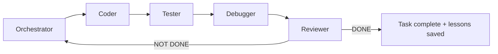
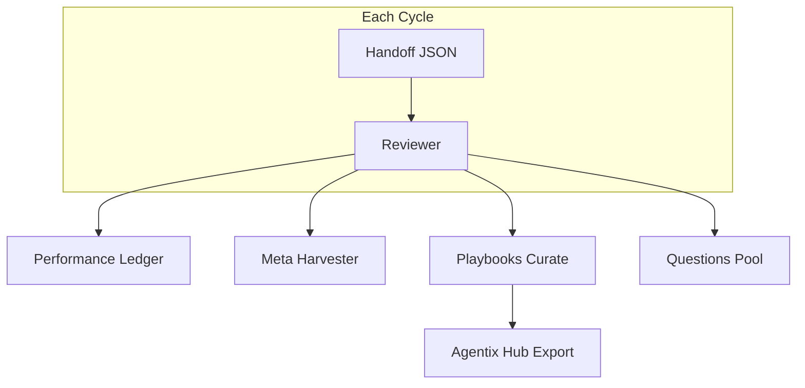

# Agentix

[](CHANGELOG.md)
[](LICENSE)
[](docs/getting-started.md)
[](docs/cross-platform.md)
[](docs/multi-frontend.md)
[](docs/proxy.md)
[](https://github.com/unhexx/agentic_loop_template/actions/workflows/agentix-loop.yml)
[](docs/README.md)
[](https://github.com/unhexx/agentic_loop_template)

**Language:** [English](README.md) · [Русский](README.ru.md)

**Production-grade, self-improving multi-role agentic development loop.**

Plan → implement → test → debug → review in a closed loop until the Reviewer confirms **DONE**. Every cycle compounds knowledge via memory, playbooks, and meta-optimization.

Maintained by [exception.expert](https://exception.expert).

---

## Table of Contents

- [Quick Start](#quick-start)
- [pxpipe for agy (Gemini 3.7 Flash)](#pxpipe-for-agy-gemini-37-flash)
- [How It Works](#how-it-works)
- [Example: One Full Cycle](#example-one-full-cycle)
- [CLI Tools](#cli-tools)
- [Dashboard security](#dashboard-security)
- [Features](#features)
- [Documentation](#documentation)
- [Project Structure](#project-structure)
- [Measured Results](#measured-results)
- [Adaptation](#adaptation-for-your-project)
- [Contributing](#contributing)

---

## Quick Start

### Prerequisites

| Requirement | Version |
|-------------|---------|
| Python | 3.10+ |
| Git | any recent |
| Agent frontend | [Grok CLI](docs/multi-frontend.md) (default on this host), Cursor, Claude Code, Blackbox |

### 1. Bootstrap (choose your platform)

<details>
<summary><strong>Windows (PowerShell)</strong></summary>

```powershell
git clone https://github.com/unhexx/agentic_loop_template.git
cd agentic_loop_template
.\Agent-Init.ps1
```

</details>

<details>
<summary><strong>Linux / macOS (bash)</strong></summary>

```bash
git clone https://github.com/unhexx/agentic_loop_template.git
cd agentic_loop_template
bash Agent-Init.sh --wizard    # interactive setup
source .venv/bin/activate
```

Init installs the harness editable (`pip install -e ".[dev]"`). Then `python -m memory` / `agentix` work from the venv.

Live Grok uses **pxpipe by default** (gateway `:8110` → host pxpipe `:8100`). Mock/CI skip the proxy. Opt out: `export AGENTIX_PROXY=0`. See [`docs/proxy.md`](docs/proxy.md). Optional second instance for Antigravity CLI (`agy`) is below — it does **not** replace the Grok imager.

Cold-start every cycle (do **not** load multi-MB `.agent` dumps):

```bash
python -m memory state snapshot --window 3
python -m memory query --top 5 --category "Common Failure Patterns"
python tools/select.py --intent bootstrap
```

See [`docs/TOP10_IMPROVEMENTS.md`](docs/TOP10_IMPROVEMENTS.md) (harness efficiency) and [`VERSION`](VERSION).


</details>

### 2. Verify with one-command demo

```bash
bash scripts/demo-loop.sh
```

Expected output (abbreviated):

```
=== Agentix Demo Loop ===
Initializing Agentix env (cross-platform)...
--- Seeding playbooks ---
Seeded 5 playbooks
--- Plan check ---
PLAN + SPEC: OK
--- Hub export ---
{"exported": ".agent/HUB_INDEX.json", "item_count": 5}
=== Demo complete. Start agent with prompts/short_orchestrator_prompt.md ===
```

### 3. Launch the agent loop

1. Open your project in **Grok**, **Cursor**, **Claude Code**, or **Blackbox**.
2. Paste the contents of [`prompts/short_orchestrator_prompt.md`](prompts/short_orchestrator_prompt.md) as the **first message**.
3. The agent starts as **Orchestrator**, reads `.agent/PLAN.md`, and begins the cycle.

> **New consumer project?** Two tiers — see [`examples/consumer-starter/`](examples/consumer-starter/): **lite** `AGENTS.md` (most products) or **full** loop via `Agent-Init.consumer.sh` (symlink the SSOT, do not copy the tree).

---

## pxpipe for agy (Gemini 3.7 Flash)

Optional **second** pxpipe on the host so Antigravity CLI (`agy`) images bulky context for `gemini-3.7-flash-high` / `gemini-3.7-flash-medium`. The Grok imager on `:8100` stays as-is. Agentix does **not** auto-wrap `agy`. Full contract: [`docs/proxy.md`](docs/proxy.md#agy-antigravity-cli-optional-second-pxpipe).

```
agy-pxpipe --print --model gemini-3.7-flash-high '...'
  GOOGLE_GEMINI_BASE_URL=http://127.0.0.1:8101
    → shim inbound (suffix → gemini-3.7-flash + thinkingLevel, prefix /google-ai-studio)
    → pxpipe :8103 (PXPIPE_MODELS=gemini-3.7-flash)
    → shim outbound (strip prefix)
    → generativelanguage.googleapis.com
```

Why the shim: pxpipe 0.13.2 only images `/google-ai-studio/…:generateContent` and the measured key `gemini-3.7-flash`. agy talks Gemini REST (`/v1beta/models/gemini-3.7-flash-high:generateContent`); the suffix is `unsupported_model` without a rewrite.

### Install (user systemd, loopback)

```bash
mkdir -p ~/.config/pxpipe-agy ~/.pxpipe-agy ~/.config/systemd/user
install -m 755 scripts/pxpipe-agy/shim.py ~/.config/pxpipe-agy/shim.py
install -m 755 scripts/pxpipe-agy/agy-pxpipe ~/.local/bin/agy-pxpipe
install -m 644 scripts/systemd/pxpipe-agy-shim.service.example \
  ~/.config/systemd/user/pxpipe-agy-shim.service
install -m 644 scripts/systemd/pxpipe-agy.service.example \
  ~/.config/systemd/user/pxpipe-agy.service
printf '%s\n' '{"models": ["gemini-3.7-flash"]}' > ~/.config/pxpipe-agy/config.json
systemctl --user daemon-reload
systemctl --user enable --now pxpipe-agy-shim.service pxpipe-agy.service
```

Do **not** restart `pxpipe.service` (`:8100`). Check:

```bash
systemctl --user is-active pxpipe.service pxpipe-agy.service pxpipe-agy-shim.service
curl -sS http://127.0.0.1:8101/health
# Grok still on :8100, agy imager on :8103
ss -tln | grep -E '8100|8101|8102|8103'
```

### Examples

Short print (prompt **must** sit on `--print=`, not as a trailing arg):

```bash
agy-pxpipe --model gemini-3.7-flash-high --print='Reply with exactly PONG and nothing else.'
agy-pxpipe --model gemini-3.7-flash-medium --print='Summarize scripts/pxpipe-agy/shim.py in 5 bullets.'
```

Interactive session through the imager:

```bash
agy-pxpipe --model gemini-3.7-flash-high
```

Plain `agy` is unchanged (InstantLegalBot / unsigned sessions keep the public Gemini path).

Synthetic check that `-high` actually images (401/400 from Google on a dummy key is fine if `compressed` is true):

```bash
python3 - <<'PY'
import json, urllib.request, urllib.error
slab = ("CONTEXT_LINE_%04d: " + ("lorem ipsum dolor sit amet " * 12) + "\n")
text = "".join(slab % i for i in range(80))
body = json.dumps({
    "systemInstruction": {"parts": [{"text": text}]},
    "contents": [{"role": "user", "parts": [{"text": "PONG"}]}],
    "generationConfig": {"maxOutputTokens": 8},
}).encode()
url = "http://127.0.0.1:8101/v1beta/models/gemini-3.7-flash-high:generateContent"
req = urllib.request.Request(url, data=body, method="POST",
    headers={"Content-Type": "application/json", "x-goog-api-key": "test"})
try:
    urllib.request.urlopen(req, timeout=60)
except urllib.error.HTTPError:
    pass
print(json.load(urllib.request.urlopen("http://127.0.0.1:8101/health")))
# events: ~/.pxpipe-agy/events.jsonl  compressed=true, model=gemini-3.7-flash
PY
```

Control: `POST :8103/google-ai-studio/v1beta/models/gemini-3.7-flash-high:generateContent` must stay `compressed=false` / `unsupported_model`. The unsuffixed id on that same path compresses.

Logs: `journalctl --user -u pxpipe-agy.service -u pxpipe-agy-shim.service -f` and `~/.pxpipe-agy/events.jsonl`. Do not quote a billed `measured_saved_pct` until `:countTokens` probes succeed.

---

## How It Works

### Sprint loop (roles)



Each role runs an inner loop: **PLAN → ACT (≤3 tool calls) → REFLECT → handoff JSON**.

### State transfer

All context moves through strict JSON handoffs ([`HANDOFF_SCHEMA.md`](HANDOFF_SCHEMA.md)). No prose after the closing `}`.

### Self-improvement stack



---

## Example: One Full Cycle

Below is a realistic mini-cycle: Orchestrator plans, Coder implements, Reviewer closes.

### Step 1 — Orchestrator plans

The agent reads the plan and picks the next INVEST task:

```bash
# Orchestrator consults playbooks before planning
python -m memory.playbooks select --query "git sync planning" --scopes "global,tool:git" --k 3
```

**Handoff excerpt** (Orchestrator → Coder):

```json
{
  "handoff_to": "Coder",
  "role": "Orchestrator",
  "current_phase": "planning",
  "summary": "Выбрал задачу P3-HUB-01: добавить export в playbooks. Git sync verified.",
  "next_input_files": ["TASK_SPECIFICATION.md", ".agent/TODO.md"],
  "git_sync_status": { "verified": true, "feature_pushed": true },
  "confidence": 0.92,
  "status": "IN_PROGRESS"
}
```

### Step 2 — Coder implements

```bash
# Coder runs tests after changes
source .venv/bin/activate
python -m memory.playbooks export --format hub
```

**Commit message** (natural Russian, human voice):

```
Добавил export hub index в playbooks и тест на валидность JSON
```

### Step 3 — Tester → Debugger → Reviewer

| Role | Action |
|------|--------|
| **Tester** | Runs `python -m memory.test_playbooks_hub`, reports coverage |
| **Debugger** | Fixes failures if any |
| **Reviewer** | Compares result to spec, updates ledger, harvests meta |

**Reviewer closes the cycle:**

```json
{
  "handoff_to": "None",
  "role": "Reviewer",
  "status": "DONE",
  "performance": {
    "cycle": 42,
    "elapsed_minutes": 1.6,
    "confidence": 0.94,
    "tests_failed": 0,
    "meta_applied": 1
  },
  "memory_updated": true,
  "patterns_merged": 2
}
```

### What gets updated automatically

| Artifact | Updated by |
|----------|------------|
| `.agent/PERFORMANCE_LEDGER.md` | Reviewer / meta_harvester |
| `.agent/PLAYBOOKS.json` | playbooks curate |
| `.agent/META_PROPOSALS.md` | meta_harvester |
| `PROJECT_CONTEXT.md` | Orchestrator + Reviewer |

---

## CLI Tools

| Command | Purpose |
|---------|---------|
| `bash scripts/demo-loop.sh` | One-command smoke demo |
| `agentix` / `python -m memory` | Console script after `pip install -e .` (same `_cli`; no PYTHONPATH) |
| `python -m memory.supervisor run --adapter mock --max-cycles 1 --no-pr` | Unattended role loop (mock CI path); adapters: mock/grok/cursor/blackbox |
| `python -m memory.supervisor run-parallel --stream name:paths/` | Disjoint streams (serial default; `--concurrent` overlaps in time; `--push` sends stream + integration branches to `origin`, never `main`), then one integration PR from the integration worktree; never merges `main` |
| `python -m memory.stream_lease claim\|renew\|release\|status` | Exclusive `owned_paths` leases for operator parallel sessions; live PID is never stolen; TTL is display-only |
| `scripts/agentix-supervisor run ...` | Bash shim for the same supervisor CLI |
| `python -m memory.dashboard serve --workdir PATH` | Operator Control Plane (HTMX UI, not the runner); loopback `:8112` |
| `scripts/agentix-dashboard serve --workdir PATH` | Bash shim for the same dashboard CLI |
| `python -m memory.playbooks select --query "..."` | Inject relevant knowledge bullets |
| `python -m memory.playbooks export --format hub` | Export Hub discovery index |
| `python -m memory.performance_ledger` | View cycle metrics |
| `python -m memory.meta_harvester harvest --handoff ...` | Capture golden trajectories |
| `python -m memory.audit_log list` | Enterprise audit trail |
| `python -m memory.resume --json` | Resume after session crash |
| `python -m memory.eval_harness --recent 5` | Score recent trajectories |
| `python -m memory.experience_harvester cycle --parent ..` | Cross-project experience harvest + adoption audit |
| `python -m memory.context_budget check --files … --compress` | Token budget gate; compress if over (no rewrite) |
| `python -m memory.compressor files --budget 12000 …` | Rule-based distillation (priority drop + head/tail) |
| `python -m memory.knowledge query --q "…" --category playbook` | Local SQLite knowledge (ingest-docs / upsert / stats) |
| `python -m memory.proxy health\|serve\|stats` | Request proxy: pxpipe front, gateway `:8110`, token stats |
| `agy-pxpipe --model gemini-3.7-flash-high --print='…'` | Optional second pxpipe for Antigravity CLI; see [pxpipe for agy](#pxpipe-for-agy-gemini-37-flash) |
| `python -m memory.meta_harvester export-sft` | Local SFT JSONL from golden DONE trajectories (no GPU) |

Supervisor drives O→C→T→R turns, validates handoffs, and on `PR_READY` opens a PR via `gh pr create` (never merges to `main`). Use `--no-pr` for local/CI dry runs. Config lives under `supervisor` in `.agent/project_config.json` (see `project_config.example.json`).

Full memory layer docs: [`memory/README.md`](memory/README.md).

---

## Dashboard security

The operator Control Plane (`python -m memory.dashboard serve --workdir PATH`, or `scripts/agentix-dashboard`) binds **loopback only** on `http://127.0.0.1:8112` — not pxpipe `:8100` and not the request gateway `:8110`. A non-loopback bind is refused (TeleGrok SR-04). Every route, including `/health` and `/ws/ui`, requires a loopback peer and Host (`ipaddress` 127/8; `Host: 127.0.0.1.nip.io` is 403).

`DASHBOARD_TOKEN` is optional. Empty (the `.env.example` placeholder) disables the check for local use. **Set a token before any SSH tunnel or Tailscale Serve/funnel.** Remote access is `ssh -L 8112:127.0.0.1:8112` (or Tailscale SSH). After the tunnel, open `http://127.0.0.1:8112/?token=…` once; subsequent HTMX partials and the WebSocket use the HttpOnly `agentix_token` cookie. Prefer `X-API-Token` / `Authorization: Bearer` over the query string. A funnel without a token is a security violation.

v1 does **not** listen on a tailnet IP. TeleGrok 0.1.0 does not ship runtime Tailscale or allowlist enforcement — do not document this UI as “protected by Tailscale.” Logs must not echo `DASHBOARD_TOKEN` or `Authorization` headers.

---

## Features

| Category | Capability |
|----------|------------|
| **Loop discipline** | 5 roles, JSON handoffs, INVEST tasks, git §11 sync |
| **Packaging** | `pip install -e ".[dev]"` / `.[dashboard]` / `.[embeddings]` / `.[mcp]`; console script `agentix`; import package `memory` |
| **Control Plane** | Loopback HTMX operator UI (`memory.dashboard` on `:8112`), not the runner |
| **Self-improvement** | Playbooks (ACE scoring), meta-harvester, performance ledger, [skills](skills/README.md) |
| **Context** | Bounded LOOP_STATE, `context_budget` gate (supervisor caps from config/env), rule-based compressor, local SQLite knowledge, [request proxy](docs/proxy.md) (**pxpipe default** + Agentix gateway) |
| **Parallel streams** | `run-parallel` with `owned_paths` + git worktrees; serial default, opt-in `--concurrent`, one integration PR |
| **Cross-platform** | `Agent-Init.ps1` + `Agent-Init.sh`, platform-adaptive prompts |
| **Multi-frontend** | Grok (default), Cursor, Claude Code, Blackbox adapters |
| **Experience harvest** | Scan sibling `AGENTS.md` / playbooks; `audit` + `cycle` self-improve |
| **Productization** | `docs/` site, consumer-starter, Agentix Hub |
| **Enterprise** | Audit log, policy samples, GitHub Actions trigger |
| **DX** | Onboarding wizard, stack templates, VS Code extension recommendations |
| **MCP** | Opt-in Linear/Jira cycle sync + Slack notify ([docs/integrations.md](docs/integrations.md)); GitHub via `grok_com_github` |

---

## Documentation

| Guide | Description |
|-------|-------------|
| [docs/getting-started.md](docs/getting-started.md) | 5-minute bootstrap |
| [docs/architecture.md](docs/architecture.md) | Roles, handoffs, memory |
| [docs/multi-frontend.md](docs/multi-frontend.md) | Cursor / Claude / Blackbox |
| [docs/metrics-roi.md](docs/metrics-roi.md) | Proof from 50+ dogfood cycles |
| [docs/proxy.md](docs/proxy.md) | Default request proxy, SLOs, opt-out, optional agy/pxpipe-agy |
| [docs/hub/README.md](docs/hub/README.md) | Playbook marketplace |
| [docs/enterprise-governance.md](docs/enterprise-governance.md) | Policy + audit |
| [docs/case-study.md](docs/case-study.md) | Dogfood case study |
| [AGENT_ROLES.md](AGENT_ROLES.md) | Per-role instructions |
| [HANDOFF_SCHEMA.md](HANDOFF_SCHEMA.md) | JSON contract |
| [DEVELOPMENT_STANDARDS.md](DEVELOPMENT_STANDARDS.md) | Process constitution |

Full index: [**docs/README.md**](docs/README.md)

---

## Project Structure

```
agentic_loop_template/
├── README.md                 # You are here
├── docs/                     # Documentation site
├── examples/
│   ├── consumer-starter/     # Adoption template
│   ├── stack-templates/      # Python API, static docs
│   └── case-study/           # Sanitized trajectory
├── memory/                   # Ledger, playbooks, meta, audit, resume, dashboard
├── prompts/                  # Short role prompts (start here)
├── scripts/demo-loop.sh      # One-command demo
├── .agent/                   # PLAN, TODO, ledger, playbooks, hub index
├── Agent-Init.ps1 / .sh      # Bootstrap scripts
├── SYSTEM_PROMPT.md          # Master prompt (fill {{placeholders}})
├── AGENT_ROLES.md            # Role blocks
└── HANDOFF_SCHEMA.md         # Handoff contract
```

---

## Measured Results

Dogfooded on this repo over **50+ cycles** (Business Efficiency Initiative, v3.4.0):

| Metric | Value |
|--------|-------|
| Avg cycle elapsed (recent) | ~1.6 min |
| Avg confidence | 0.94 |
| Tests failed (recent band) | 0 |
| Meta/playbook improvements | Applied each qualifying cycle |

Source: [`.agent/PERFORMANCE_LEDGER.md`](.agent/PERFORMANCE_LEDGER.md) · [docs/metrics-roi.md](docs/metrics-roi.md)

---

## Adaptation for Your Project

1. Copy this template into your repo (or use [`examples/consumer-starter/`](examples/consumer-starter/)).
2. Fill `{{placeholders}}` in [`SYSTEM_PROMPT.md`](SYSTEM_PROMPT.md).
3. Create [`TASK_SPECIFICATION.md`](TASK_SPECIFICATION.md) with testable requirements.
4. Run bootstrap (`Agent-Init.ps1` or `Agent-Init.sh --wizard`).
5. Add `agentic_loop_template/` and cycle artifacts to `.gitignore` in consumer repos.
6. Customize [`TOOLS_REGISTRY.md`](TOOLS_REGISTRY.md) for your MCP skills.

---

## Contributing

- Follow [`DEVELOPMENT_STANDARDS.md`](DEVELOPMENT_STANDARDS.md) (INVEST tasks, git §11, UTF-8).
- Commit messages: natural Russian, human senior-dev voice.
- Changes must be backward-compatible or documented in [`CHANGELOG.md`](CHANGELOG.md).
- [Open an issue](https://github.com/unhexx/agentic_loop_template/issues) or PR on GitHub.

---

## License

[MIT](LICENSE) · **Agentix 3.9.3** · Maintained by **exception.expert**