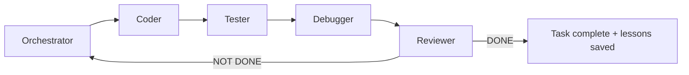
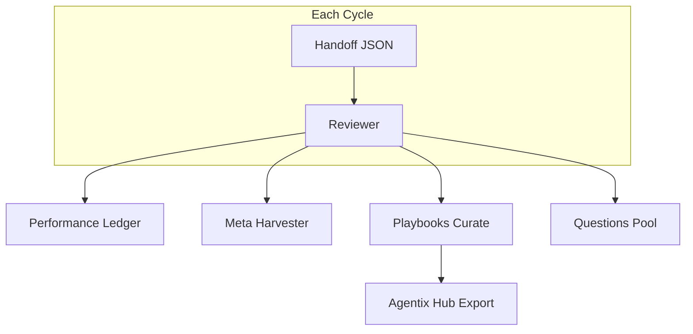

# Agentix

[](CHANGELOG.md)
[](LICENSE)
[](docs/ru/getting-started.md)
[](docs/cross-platform.md)
[](docs/multi-frontend.md)
[](docs/proxy.md)
[](https://github.com/unhexx/agentic_loop_template/actions/workflows/agentix-loop.yml)
[](docs/ru/README.md)
[](https://github.com/unhexx/agentic_loop_template)

**Language:** [English](README.md) · [Русский](README.ru.md)

**Промышленный самоулучшающийся многоролевой агентный цикл разработки.**

Планировать → реализовать → тестировать → отлаживать → ревьюить в замкнутом цикле, пока Reviewer не подтвердит **DONE**. Каждый цикл накапливает знание через память, playbook и мета-оптимизацию.

Поддерживается [exception.expert](https://exception.expert).

---

## Содержание

- [Быстрый старт](#быстрый-старт)
- [pxpipe для agy (Gemini 3.7 Flash)](#pxpipe-для-agy-gemini-37-flash)
- [Как это устроено](#как-это-устроено)
- [Пример: один полный цикл](#пример-один-полный-цикл)
- [Инструменты CLI](#инструменты-cli)
- [Безопасность дашборда](#безопасность-дашборда)
- [Возможности](#возможности)
- [Документация](#документация)
- [Структура проекта](#структура-проекта)
- [Измеренные результаты](#измеренные-результаты)
- [Адаптация](#адаптация-под-ваш-проект)
- [Участие](#участие)

---

## Быстрый старт

### Требования

| Требование | Версия |
|------------|--------|
| Python | 3.10+ |
| Git | любая свежая |
| Фронтенд агента | [Grok CLI](docs/multi-frontend.md) (English) (по умолчанию на этом хосте), Cursor, Claude Code, Blackbox |

### 1. Bootstrap (выберите платформу)

<details>
<summary><strong>Windows (PowerShell)</strong></summary>

```powershell
git clone https://github.com/unhexx/agentic_loop_template.git
cd agentic_loop_template
.\Agent-Init.ps1
```

</details>

<details>
<summary><strong>Linux / macOS (bash)</strong></summary>

```bash
git clone https://github.com/unhexx/agentic_loop_template.git
cd agentic_loop_template
bash Agent-Init.sh --wizard    # interactive setup
source .venv/bin/activate
```

Init ставит обвязку editable (`pip install -e ".[dev]"`). После этого `python -m memory` / `agentix` работают из venv.

Живой Grok использует **pxpipe по умолчанию** (шлюз `:8110` → host pxpipe `:8100`). Mock/CI пропускают прокси. Отключить: `export AGENTIX_PROXY=0`. См. [`docs/proxy.md`](docs/proxy.md) (English). Опциональный второй инстанс для Antigravity CLI (`agy`) ниже — он **не** заменяет imager Grok.

Холодный старт каждого цикла (**не** загружайте многомегабайтные дампы `.agent`):

```bash
python -m memory state snapshot --window 3
python -m memory query --top 5 --category "Common Failure Patterns"
python tools/select.py --intent bootstrap
```

См. [`docs/TOP10_IMPROVEMENTS.md`](docs/TOP10_IMPROVEMENTS.md) (English) (эффективность обвязки) и [`VERSION`](VERSION).


</details>

### 2. Проверка однокомандным демо

```bash
bash scripts/demo-loop.sh
```

Ожидаемый вывод (сокращённо):

```
=== Agentix Demo Loop ===
Initializing Agentix env (cross-platform)...
--- Seeding playbooks ---
Seeded 5 playbooks
--- Plan check ---
PLAN + SPEC: OK
--- Hub export ---
{"exported": ".agent/HUB_INDEX.json", "item_count": 5}
=== Demo complete. Start agent with prompts/short_orchestrator_prompt.md ===
```

### 3. Запуск цикла агента

1. Откройте проект в **Grok**, **Cursor**, **Claude Code** или **Blackbox**.
2. Вставьте содержимое [`prompts/short_orchestrator_prompt.md`](prompts/short_orchestrator_prompt.md) как **первое сообщение**.
3. Агент стартует как **Orchestrator**, читает `.agent/PLAN.md` и начинает цикл.

> **Новый продуктовый проект?** Два уровня — см. [`examples/consumer-starter/`](examples/consumer-starter/) (English): **lite** `AGENTS.md` (большинство продуктов) или **полный** цикл через `Agent-Init.consumer.sh` (симлинк на SSOT, не копируйте дерево).

---

## pxpipe для agy (Gemini 3.7 Flash)

Опциональный **второй** pxpipe на хосте, чтобы Antigravity CLI (`agy`) сжимал объёмный контекст для `gemini-3.7-flash-high` / `gemini-3.7-flash-medium`. Imager Grok на `:8100` не трогаем. Agentix **не** оборачивает `agy` автоматически. Полный контракт: [`docs/proxy.md`](docs/proxy.md#agy-antigravity-cli-optional-second-pxpipe) (English).

```
agy-pxpipe --print --model gemini-3.7-flash-high '...'
  GOOGLE_GEMINI_BASE_URL=http://127.0.0.1:8101
    → shim inbound (suffix → gemini-3.7-flash + thinkingLevel, prefix /google-ai-studio)
    → pxpipe :8103 (PXPIPE_MODELS=gemini-3.7-flash)
    → shim outbound (strip prefix)
    → generativelanguage.googleapis.com
```

Зачем shim: pxpipe 0.13.2 имажит только `/google-ai-studio/…:generateContent` и измеренный ключ `gemini-3.7-flash`. agy говорит Gemini REST (`/v1beta/models/gemini-3.7-flash-high:generateContent`); суффикс даёт `unsupported_model` без переписывания.

### Установка (user systemd, loopback)

```bash
mkdir -p ~/.config/pxpipe-agy ~/.pxpipe-agy ~/.config/systemd/user
install -m 755 scripts/pxpipe-agy/shim.py ~/.config/pxpipe-agy/shim.py
install -m 755 scripts/pxpipe-agy/agy-pxpipe ~/.local/bin/agy-pxpipe
install -m 644 scripts/systemd/pxpipe-agy-shim.service.example \
  ~/.config/systemd/user/pxpipe-agy-shim.service
install -m 644 scripts/systemd/pxpipe-agy.service.example \
  ~/.config/systemd/user/pxpipe-agy.service
printf '%s\n' '{"models": ["gemini-3.7-flash"]}' > ~/.config/pxpipe-agy/config.json
systemctl --user daemon-reload
systemctl --user enable --now pxpipe-agy-shim.service pxpipe-agy.service
```

**Не** перезапускайте `pxpipe.service` (`:8100`). Проверка:

```bash
systemctl --user is-active pxpipe.service pxpipe-agy.service pxpipe-agy-shim.service
curl -sS http://127.0.0.1:8101/health
# Grok still on :8100, agy imager on :8103
ss -tln | grep -E '8100|8101|8102|8103'
```

### Примеры

Короткий print (промпт **должен** стоять на `--print=`, не хвостовым аргументом):

```bash
agy-pxpipe --model gemini-3.7-flash-high --print='Reply with exactly PONG and nothing else.'
agy-pxpipe --model gemini-3.7-flash-medium --print='Summarize scripts/pxpipe-agy/shim.py in 5 bullets.'
```

Интерактивная сессия через imager:

```bash
agy-pxpipe --model gemini-3.7-flash-high
```

Обычный `agy` не меняется (InstantLegalBot / неподписанные сессии остаются на публичном Gemini).

Синтетическая проверка, что `-high` действительно имажится (401/400 от Google на фиктивном ключе нормальны, если `compressed` равен true):

```bash
python3 - <<'PY'
import json, urllib.request, urllib.error
slab = ("CONTEXT_LINE_%04d: " + ("lorem ipsum dolor sit amet " * 12) + "\n")
text = "".join(slab % i for i in range(80))
body = json.dumps({
    "systemInstruction": {"parts": [{"text": text}]},
    "contents": [{"role": "user", "parts": [{"text": "PONG"}]}],
    "generationConfig": {"maxOutputTokens": 8},
}).encode()
url = "http://127.0.0.1:8101/v1beta/models/gemini-3.7-flash-high:generateContent"
req = urllib.request.Request(url, data=body, method="POST",
    headers={"Content-Type": "application/json", "x-goog-api-key": "test"})
try:
    urllib.request.urlopen(req, timeout=60)
except urllib.error.HTTPError:
    pass
print(json.load(urllib.request.urlopen("http://127.0.0.1:8101/health")))
# events: ~/.pxpipe-agy/events.jsonl  compressed=true, model=gemini-3.7-flash
PY
```

Контроль: `POST :8103/google-ai-studio/v1beta/models/gemini-3.7-flash-high:generateContent` должен оставаться `compressed=false` / `unsupported_model`. Тот же путь без суффикса сжимается.

Логи: `journalctl --user -u pxpipe-agy.service -u pxpipe-agy-shim.service -f` и `~/.pxpipe-agy/events.jsonl`. Не цитируйте биллируемый `measured_saved_pct`, пока пробы `:countTokens` не прошли.

---

## Как это устроено

### Спринтовый цикл (роли)



Каждая роль крутит внутренний цикл: **PLAN → ACT (≤3 вызова инструментов) → REFLECT → handoff JSON**.

### Передача состояния

Весь контекст идёт через строгие JSON-handoff ([`HANDOFF_SCHEMA.md`](HANDOFF_SCHEMA.md) (English)). После закрывающей `}` прозы быть не должно.

### Стек самоулучшения



---

## Пример: один полный цикл

Ниже реалистичный мини-цикл: Orchestrator планирует, Coder реализует, Reviewer закрывает.

### Шаг 1 — Orchestrator планирует

Агент читает план и выбирает следующую INVEST-задачу:

```bash
# Orchestrator consults playbooks before planning
python -m memory.playbooks select --query "git sync planning" --scopes "global,tool:git" --k 3
```

**Фрагмент handoff** (Orchestrator → Coder):

```json
{
  "handoff_to": "Coder",
  "role": "Orchestrator",
  "current_phase": "planning",
  "summary": "Выбрал задачу P3-HUB-01: добавить export в playbooks. Git sync verified.",
  "next_input_files": ["TASK_SPECIFICATION.md", ".agent/TODO.md"],
  "git_sync_status": { "verified": true, "feature_pushed": true },
  "confidence": 0.92,
  "status": "IN_PROGRESS"
}
```

### Шаг 2 — Coder реализует

```bash
# Coder runs tests after changes
source .venv/bin/activate
python -m memory.playbooks export --format hub
```

**Сообщение коммита** (живой русский, человеческий голос):

```
Добавил export hub index в playbooks и тест на валидность JSON
```

### Шаг 3 — Tester → Debugger → Reviewer

| Роль | Действие |
|------|----------|
| **Tester** | Запускает `python -m memory.test_playbooks_hub`, отчитывается по покрытию |
| **Debugger** | Чинит падения, если есть |
| **Reviewer** | Сверяет результат со спецификацией, обновляет ledger, собирает мету |

**Reviewer закрывает цикл:**

```json
{
  "handoff_to": "None",
  "role": "Reviewer",
  "status": "DONE",
  "performance": {
    "cycle": 42,
    "elapsed_minutes": 1.6,
    "confidence": 0.94,
    "tests_failed": 0,
    "meta_applied": 1
  },
  "memory_updated": true,
  "patterns_merged": 2
}
```

### Что обновляется автоматически

| Артефакт | Кто обновляет |
|----------|---------------|
| `.agent/PERFORMANCE_LEDGER.md` | Reviewer / meta_harvester |
| `.agent/PLAYBOOKS.json` | playbooks curate |
| `.agent/META_PROPOSALS.md` | meta_harvester |
| `PROJECT_CONTEXT.md` | Orchestrator + Reviewer |

---

## Инструменты CLI

| Команда | Назначение |
|---------|------------|
| `bash scripts/demo-loop.sh` | Однокомандное дымовое демо |
| `agentix` / `python -m memory` | Console script после `pip install -e .` (тот же `_cli`; без PYTHONPATH) |
| `python -m memory.supervisor run --adapter mock --max-cycles 1 --no-pr` | Автономный ролевой цикл (mock-путь CI); адаптеры: mock/grok/cursor/blackbox |
| `python -m memory.supervisor run-parallel --stream name:paths/` | Непересекающиеся потоки (по умолчанию serial; `--concurrent` перекрывает по времени; `--push` отправляет ветки потока и интеграции на `origin`, никогда `main`), затем один интеграционный PR из integration worktree; `main` не мержит |
| `python -m memory.stream_lease claim\|renew\|release\|status` | Эксклюзивные lease на `owned_paths` для параллельных сессий оператора; живой PID не отбирается; TTL только для отображения |
| `scripts/agentix-supervisor run ...` | Bash-обёртка того же CLI супервизора |
| `python -m memory.dashboard serve --workdir PATH` | Операторский Control Plane (HTMX UI, не раннер); loopback `:8112` |
| `scripts/agentix-dashboard serve --workdir PATH` | Bash-обёртка того же CLI дашборда |
| `python -m memory.playbooks select --query "..."` | Подставить релевантные буллеты знаний |
| `python -m memory.playbooks export --format hub` | Экспорт индекса Hub discovery |
| `python -m memory.performance_ledger` | Метрики циклов |
| `python -m memory.meta_harvester harvest --handoff ...` | Снять золотые траектории |
| `python -m memory.audit_log list` | Корпоративный audit trail |
| `python -m memory.resume --json` | Продолжить после падения сессии |
| `python -m memory.eval_harness --recent 5` | Оценить недавние траектории |
| `python -m memory.experience_harvester cycle --parent ..` | Межпроектный harvest опыта + audit внедрения |
| `python -m memory.context_budget check --files … --compress` | Гейт токен-бюджета; сжать, если превышен (без переписывания) |
| `python -m memory.compressor files --budget 12000 …` | Дистилляция по правилам (priority drop + head/tail) |
| `python -m memory.knowledge query --q "…" --category playbook` | Локальный SQLite knowledge (ingest-docs / upsert / stats) |
| `python -m memory.proxy health\|serve\|stats` | Прокси запросов: фронт pxpipe, шлюз `:8110`, статистика токенов |
| `agy-pxpipe --model gemini-3.7-flash-high --print='…'` | Опциональный второй pxpipe для Antigravity CLI; см. [pxpipe для agy](#pxpipe-для-agy-gemini-37-flash) |
| `python -m memory.meta_harvester export-sft` | Локальный SFT JSONL из золотых траекторий DONE (без GPU) |

Супервизор гоняет ходы O→C→T→R, валидирует handoff и на `PR_READY` открывает PR через `gh pr create` (`main` не мержит). Для локальных/CI прогонов — `--no-pr`. Конфиг лежит в `supervisor` внутри `.agent/project_config.json` (см. `project_config.example.json`).

Полная документация слоя памяти: [`memory/README.md`](memory/README.md) (English).

---

## Безопасность дашборда

Операторский Control Plane (`python -m memory.dashboard serve --workdir PATH` или `scripts/agentix-dashboard`) слушает **только loopback** на `http://127.0.0.1:8112` — не pxpipe `:8100` и не шлюз запросов `:8110`. Bind не на loopback отклоняется (TeleGrok SR-04). Каждый маршрут, включая `/health` и `/ws/ui`, требует loopback-пира и Host (`ipaddress` 127/8; `Host: 127.0.0.1.nip.io` даёт 403).

`DASHBOARD_TOKEN` опционален. Пустой (плейсхолдер из `.env.example`) отключает проверку для локальной работы. **Задайте токен до любого SSH-туннеля или Tailscale Serve/funnel.** Удалённый доступ: `ssh -L 8112:127.0.0.1:8112` (или Tailscale SSH). После туннеля один раз откройте `http://127.0.0.1:8112/?token=…`; последующие HTMX-partial и WebSocket используют HttpOnly-cookie `agentix_token`. Предпочитайте `X-API-Token` / `Authorization: Bearer`, а не query string. Funnel без токена — нарушение безопасности.

v1 **не** слушает IP tailnet. TeleGrok 0.1.0 не поставляет runtime Tailscale и не enforce'ит allowlist — не описывайте этот UI как «защищённый Tailscale». Логи не должны эхоить `DASHBOARD_TOKEN` или заголовки `Authorization`.

---

## Возможности

| Категория | Возможность |
|-----------|-------------|
| **Дисциплина цикла** | 5 ролей, JSON-handoff, INVEST-задачи, git §11 sync |
| **Упаковка** | `pip install -e ".[dev]"` / `.[dashboard]` / `.[mcp]`; console script `agentix`; пакет импорта `memory` |
| **Control Plane** | Loopback HTMX UI оператора (`memory.dashboard` на `:8112`), не раннер |
| **Самоулучшение** | Playbook (ACE scoring), meta-harvester, performance ledger, [skills](skills/README.md) (English) |
| **Контекст** | Ограниченный LOOP_STATE, гейт `context_budget` (лимиты супервизора из config/env), компрессор по правилам, локальный SQLite knowledge, [прокси запросов](docs/proxy.md) (English) (**pxpipe по умолчанию** + шлюз Agentix) |
| **Параллельные потоки** | `run-parallel` с `owned_paths` + git worktree; по умолчанию serial, опционально `--concurrent`, один интеграционный PR |
| **Кросс-платформа** | `Agent-Init.ps1` + `Agent-Init.sh`, платформенные промпты |
| **Несколько фронтендов** | Адаптеры Grok (по умолчанию), Cursor, Claude Code, Blackbox |
| **Harvest опыта** | Скан соседних `AGENTS.md` / playbook; `audit` + `cycle` self-improve |
| **Продуктизация** | сайт `docs/`, consumer-starter, Agentix Hub |
| **Enterprise** | Audit log, образцы policy, триггер GitHub Actions |
| **DX** | Мастер онбординга, stack-шаблоны, рекомендации расширений VS Code |
| **MCP** | Opt-in синхронизация Linear/Jira и Slack ([docs/integrations.md](docs/integrations.md)); GitHub через `grok_com_github` |

---

## Документация

| Гайд | Описание |
|------|----------|
| [docs/ru/getting-started.md](docs/ru/getting-started.md) | Bootstrap за 5 минут |
| [docs/architecture.md](docs/architecture.md) (English) | Роли, handoff, память |
| [docs/multi-frontend.md](docs/multi-frontend.md) (English) | Cursor / Claude / Blackbox |
| [docs/metrics-roi.md](docs/metrics-roi.md) (English) | Доказательства с 50+ циклов dogfood |
| [docs/proxy.md](docs/proxy.md) (English) | Прокси запросов по умолчанию, SLO, отказ, опциональный agy/pxpipe-agy |
| [docs/hub/README.md](docs/hub/README.md) (English) | Marketplace playbook |
| [docs/enterprise-governance.md](docs/enterprise-governance.md) (English) | Policy + audit |
| [docs/case-study.md](docs/case-study.md) (English) | Кейс dogfood |
| [AGENT_ROLES.md](AGENT_ROLES.md) (English) | Инструкции по ролям |
| [HANDOFF_SCHEMA.md](HANDOFF_SCHEMA.md) (English) | JSON-контракт |
| [DEVELOPMENT_STANDARDS.md](DEVELOPMENT_STANDARDS.md) (English) | Процессная конституция |

Полный индекс: [**docs/ru/README.md**](docs/ru/README.md)

---

## Структура проекта

```
agentic_loop_template/
├── README.md                 # You are here
├── docs/                     # Documentation site
├── examples/
│   ├── consumer-starter/     # Adoption template
│   ├── stack-templates/      # Python API, static docs
│   └── case-study/           # Sanitized trajectory
├── memory/                   # Ledger, playbooks, meta, audit, resume, dashboard
├── prompts/                  # Short role prompts (start here)
├── scripts/demo-loop.sh      # One-command demo
├── .agent/                   # PLAN, TODO, ledger, playbooks, hub index
├── Agent-Init.ps1 / .sh      # Bootstrap scripts
├── SYSTEM_PROMPT.md          # Master prompt (fill {{placeholders}})
├── AGENT_ROLES.md            # Role blocks
└── HANDOFF_SCHEMA.md         # Handoff contract
```

---

## Измеренные результаты

Dogfood на этом репозитории за **50+ циклов** (Business Efficiency Initiative, v3.4.0):

| Метрика | Значение |
|---------|----------|
| Среднее время цикла (недавние) | ~1.6 мин |
| Средняя уверенность | 0.94 |
| Упавшие тесты (недавняя полоса) | 0 |
| Улучшения meta/playbook | Применяются в каждом подходящем цикле |

Источник: [`.agent/PERFORMANCE_LEDGER.md`](.agent/PERFORMANCE_LEDGER.md) · [docs/metrics-roi.md](docs/metrics-roi.md) (English)

---

## Адаптация под ваш проект

1. Скопируйте этот шаблон в свой репозиторий (или используйте [`examples/consumer-starter/`](examples/consumer-starter/) (English)).
2. Заполните `{{placeholders}}` в [`SYSTEM_PROMPT.md`](SYSTEM_PROMPT.md) (English).
3. Создайте [`TASK_SPECIFICATION.md`](TASK_SPECIFICATION.md) (English) с проверяемыми требованиями.
4. Запустите bootstrap (`Agent-Init.ps1` или `Agent-Init.sh --wizard`).
5. Добавьте `agentic_loop_template/` и артефакты цикла в `.gitignore` продуктовых репозиториев.
6. Настройте [`TOOLS_REGISTRY.md`](TOOLS_REGISTRY.md) (English) под свои MCP-навыки.

---

## Участие

- Следуйте [`DEVELOPMENT_STANDARDS.md`](DEVELOPMENT_STANDARDS.md) (English) (INVEST-задачи, git §11, UTF-8).
- Сообщения коммитов: живой русский, голос старшего разработчика.
- Изменения должны быть обратно совместимы или описаны в [`CHANGELOG.md`](CHANGELOG.md) (English).
- [Откройте issue](https://github.com/unhexx/agentic_loop_template/issues) или PR на GitHub.

---

## Лицензия

[MIT](LICENSE) · **Agentix 3.13.0** · Поддерживается **exception.expert**
