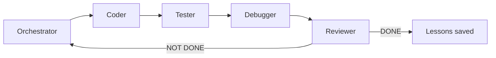
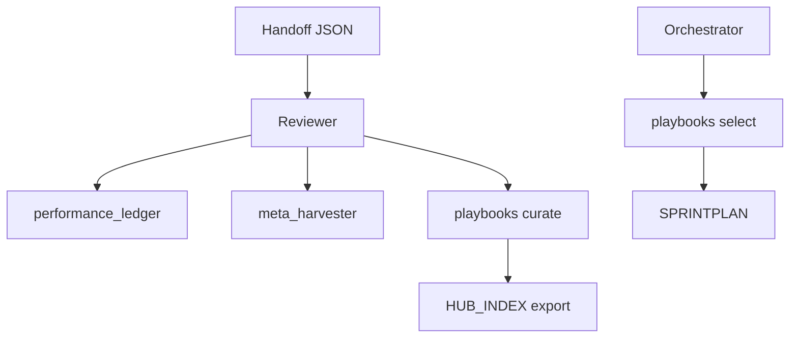

# Architecture

[](../README.md)
[](../HANDOFF_SCHEMA.md)

How the Agentix loop is structured: roles, state transfer, and self-improvement layers.

---

## Loop Overview



Each role: **PLAN → ACT (≤3 tool calls) → REFLECT → handoff JSON**.

---

## Core Components

| Layer | Location | Purpose |
|-------|----------|---------|
| Packaging | `pyproject.toml` | Dist name `agentix`, import `memory`. `pip install -e ".[dev]"` / `.[dashboard]` / `.[tokens]` / `.[mcp]`. `.[dev]` includes tiktoken. Console scripts `agentix`, `agentix-supervisor`, `agentix-dashboard`, `agentix-proxy` |
| Context budget | `memory/context_budget.py` | tiktoken extra (`dev`/`tokens`); fallback chars/4; per-model encoding; supervisor caps from `context_budget` (`prompt_body_chars`, `snap_json_chars`, `knowledge_budget_tokens`, `prompt_token_cap`) |
| Roles & prompts | `AGENT_ROLES.md`, `prompts/` | Per-role discipline |
| Handoffs | `HANDOFF_SCHEMA.md` | State transfer contract |
| Memory | `memory/` | questions_collector, meta_harvester (impl. `memory/meta/`), experience_harvester (impl. `memory/experience/`), playbooks, ledger |
| Planning | `.agent/PLAN.md`, `.agent/TODO.md` | Iteration continuity |
| Playbooks | `.agent/PLAYBOOKS.json` | Knowledge bullets (ACE scoring; optional embeddings when `playbooks.relevance=embed`) |
| Hub | `.agent/HUB_INDEX.json` | Exportable discovery index |
| Audit | `memory/audit_log.py` | Enterprise trail (P5) |
| MCP integrations | `memory/integrations/` | Opt-in Linear/Jira TODO sync + Slack notify; default `enabled: false` |
| Resume | `memory/resume.py` | Crash recovery (P7) |
| Request proxy | `memory/proxy/` | Loopback `:8110` gateway → host pxpipe `:8100` ([docs/proxy.md](proxy.md)) |
| Control Plane | `memory.dashboard` | operator HTMX UI, not the runner |
| Stream identity | `memory/stream_context.py` | ContextVar then `AGENTIX_*` env; `apply_stream_env` copies into the child dict **once** per spawn |
| Agent lock | `memory/agent_lock.py` | stdlib `O_EXCL` + PID on `.agent/<name>.lock`; stale-PID recovery; named locks for state / handoff / streams / leases / writers |
| Stream leases | `memory/stream_lease.py` | Exclusive `owned_paths` claim (`python -m memory.stream_lease`); **live PID is never stolen**; TTL display-only |
| Stream git | `memory/stream_git.py` | Dedicated integration worktree; `--no-ff` merge; opt-in push to `origin`; steady-state never moves hub `HEAD`; never merge/push `main` |
| Streams page | `memory.dashboard` `/streams` | Per-stream status, worktree, heartbeat age, STOP; Control Plane STOP fans out |

---

## Handoff Example

Every role ends with exactly one JSON object:

```json
{
  "handoff_to": "Coder",
  "role": "Orchestrator",
  "summary": "Planned next INVEST task. Git sync verified.",
  "next_input_files": [".agent/TODO.md"],
  "git_sync_status": { "verified": true },
  "confidence": 0.9,
  "status": "IN_PROGRESS"
}
```

Full schema: [HANDOFF_SCHEMA.md](../HANDOFF_SCHEMA.md).

---

## Self-Improvement Stack

| Module | CLI | When |
|--------|-----|------|
| Performance Ledger | `python -m memory.performance_ledger` | Reviewer on DONE |
| Meta Harvester | `python -m memory.meta_harvester harvest` | High-quality cycles |
| Playbooks | `python -m memory.playbooks select/curate` | PLAN / REFLECT |
| Questions Pool | `python -m memory.questions_collector` | Non-blocking approvals |
| Eval Harness | `python -m memory.eval_harness` | Trajectory scoring |

---

## Data Flow



---

## Related

- [Metrics & ROI](metrics-roi.md) — measured cycle gains
- [Hub](hub/README.md) — playbook marketplace
- [memory/README.md](../memory/README.md) — memory layer API
- [Agents Dashboard design](superpowers/specs/2026-08-21-agents-dashboard-design.md) — Control Plane spec (shipped `:8112` / 3.8.0)
- [P8 Harness Hardening](superpowers/specs/2026-08-24-p8-harness-hardening-design.md) — packaging, observability, extract, init parity, state DI, CI (3.9.0)
- [P8-11 concurrent fan-out](superpowers/specs/2026-08-26-p8-11-concurrent-fanout-design.md) — `--concurrent` + `agent_lock` (3.10.0)
- [P8-14 context budgets](superpowers/specs/2026-08-26-p8-14-context-budgets-design.md) — supervisor caps from `context_budget` (3.10.1)
- [Conflict-free parallel sessions](superpowers/specs/2026-08-26-conflict-free-parallel-sessions-design.md) — leases, `--push`, STOP fan-out, Streams page (target 3.11.0)
- [PARALLEL_PROTOCOL.md](../PARALLEL_PROTOCOL.md) — operator session recipe, leases, never-merge-`main`